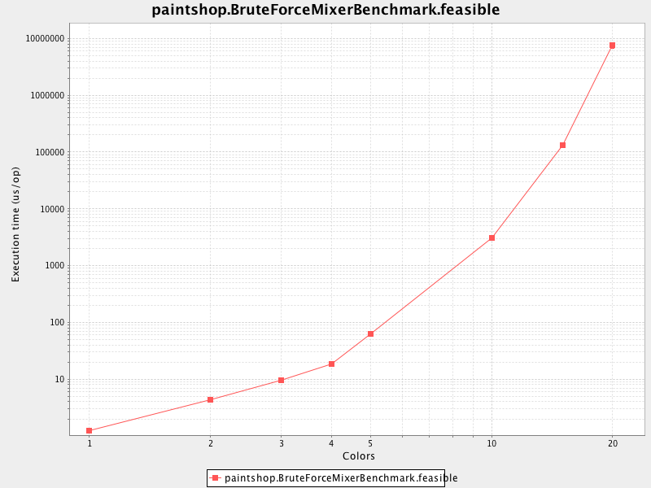

Problem Description *(details omitted)*
---------------------------------------
Given a list of orders and a set of available paints (colors x sheens), find the optimal mix so that:
1. all the customers are satisfied (hard-constraint)
2. has the lowest cost (soft-constraint)
 
 
Background
----------

This type of problem is scientifically known as [Constraint Satisfaction Problem](https://en.wikipedia.org/wiki/Constraint_satisfaction_problem)
and relates to the combinatorial optimization topic. These problems consist in finding an optimal solution
from a finite set of values under specific constraints (such as the ones mentioned in the description). 

Although they may seem simple to solve at a first sight, in reality those problems are really hard to solve: potentially
NP-complete or harder. As a result, there is no silver bullet to find the optimal solution in reasonable time. Even
relatively small data sets can produce a huge search space that any brute force algorithm would take too long to traverse.
As an example, the running time for the **Paint Shop** problem grows exponentially as can be seen in the micro benchmark
below: *[Note: axis are in logarithm scale and running times are measured in microseconds]*




>*Note:* To run the benchmarks yourself, on `sbt` run:
>```
>benchmark/charts
>```
>The charts are generated under `paint-shop/benchmark/target/scala-2.12/`


Throwing more parallelism (threads or computers) doesn't help much for large data sets. A more practical and scalable 
solution to these problems is a combination of heuristics and meta-heuristics (such as Hill Climbing, Tabu Search,
Simulated Annealing, etc). Such algorithms do not guarantee to find an optimal solution but they are likely to find a
pretty good solution in reasonable time.

>*Side note:* In fact, this is a topic that fascinates me as I have had the opportunity to deal with a CSP problem in real 
life (hardware allocation optimization). This inspired me to write a two-parts article
([1](http://www.devmedia.com.br/red-hat-resolvendo-problemas-de-planejamento-com-optaplanner-parte-1/31981) \&
[2](http://www.devmedia.com.br/como-escolher-o-algoritmo-mais-eficiente-com-optaplanner-parte-2/32085)) for a tech 
magazine covering the topic as well as the framework [OptaPlanner](http://www.optaplanner.org/) (partially paywalled,
in Portuguese).


Solution
--------
This project provides 2 strategies to tackle the Paint Shop problem: brute force and local search (Tabu Search).
These strategies can be chosen via command line argument (details below).

Before even entering the search space exploration phase, the `Mixer` attempts to reduce the search space by eliminating
values (paints) that are fixed (customer selection with single paint). This reduction is performed recursively so that
other multi-value selections can become singleton during the reduction process. Unfeasible combinations derived from
singleton selections are also identified at this stage, which prevents pointless execution of subsequent phases. 

#### Brute Force
Explores the search space via exhaustive search and guarantees to find the optimal solution (if there is any) as long
as unbounded running time is acceptable. The time complexity of this algorithm is `O(n^m)` in the worst case scenario,
where `n` = sheens (2) and `m` = colors. This strategy is only indicated for relatively small data sets (up to 20 colors). 

#### Tabu Search
Explores the search space using a simplified implementation of the [Tabu Search](https://en.wikipedia.org/wiki/Tabu_search)
meta-heuristic. This strategy is suitable for large inputs where the search space is too big to be explored via exhaustive
search. Given that the algorithm may not visit all possible combinations in the search space, **it does not guarantee to find 
an optimal nor a feasible solution**. The more time is given to the algorithm, the better the solution will likely be.
Moreover, it has to be given a condition to stop the search. Currently it only supports a time-based condition but others
(e.g. max iterations, max iterations without improvement, etc) can be easily introduced. 

### Usage
#### Requirements
- Scala 2.12
- SBT

On `sbt`:

* Brute force strategy
```
run <path to file>
```

* Tabu search strategy
```
run <path to file> --tabu-search [<timeout in secs>]
```
**timeout defaults to 5 seconds if not provided*

>*Note:* There are some sample input files available in the classpath under `/samples/` that can be used for testing.
The `20x1000_feasible.txt` and `40x10000_feasible.txt` files in particular can be used to see the difference in
running time between both algorithms.

### Bonus

- **Extensibility:** new sheens can be introduced without requiring any changes to the parsing/solving algorithms. Just
need to add a new subtype for the `Sheen` sealed trait
- **Benchmarks:** [JMH](http://openjdk.java.net/projects/code-tools/jmh) benchmarks for the brute force algorithm with
chart generation available in the `benchmark` submodule
 
